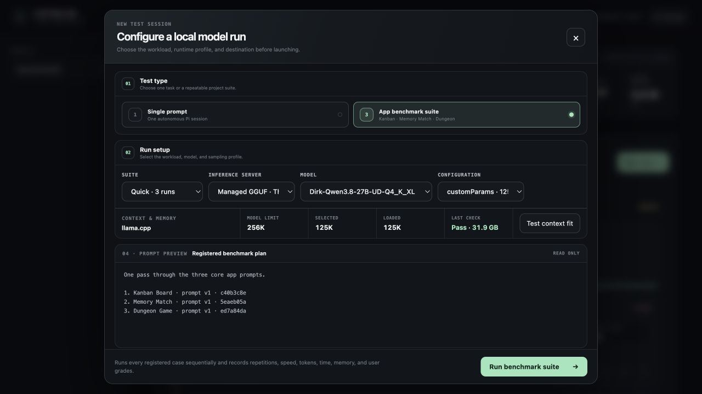
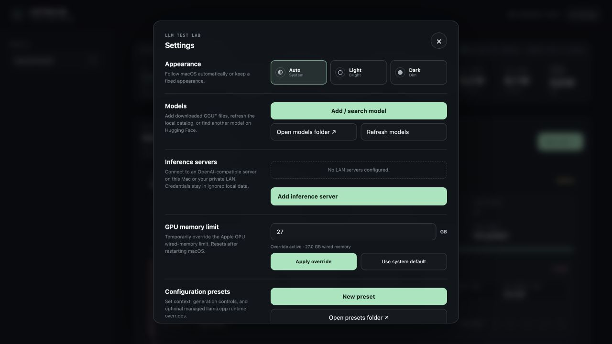
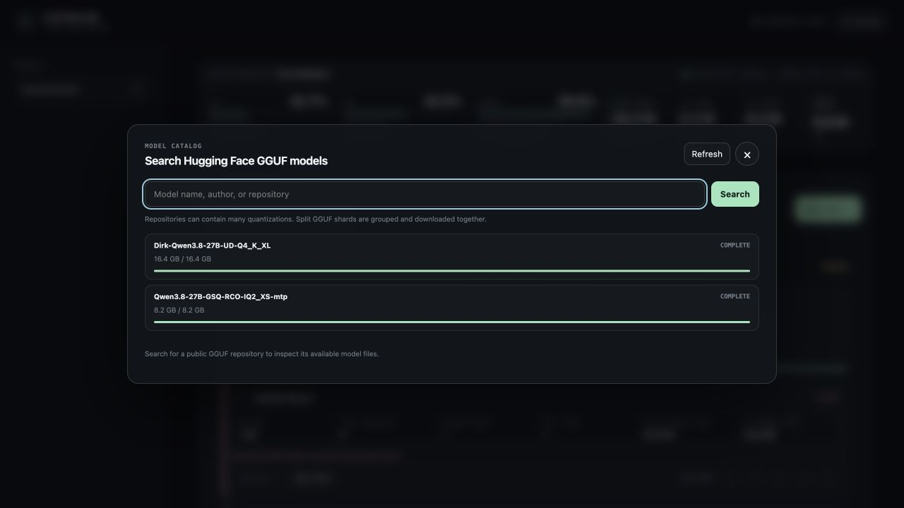
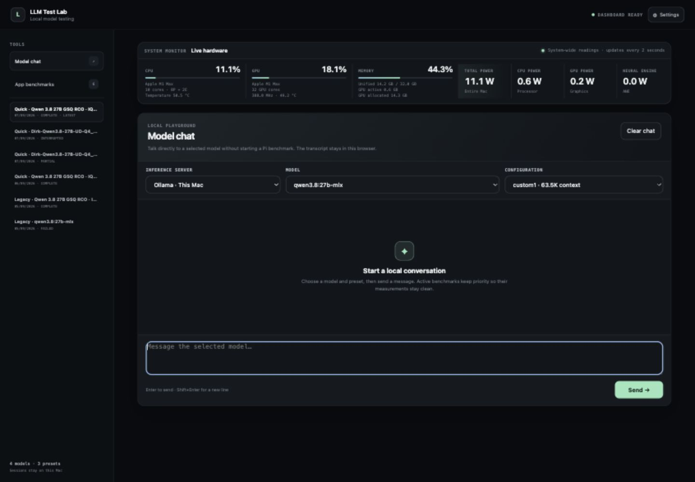
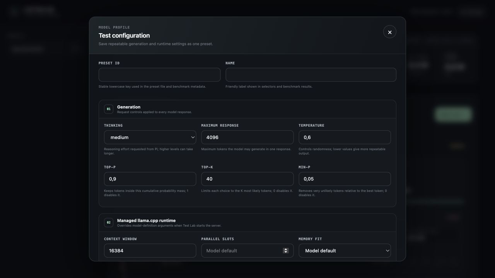
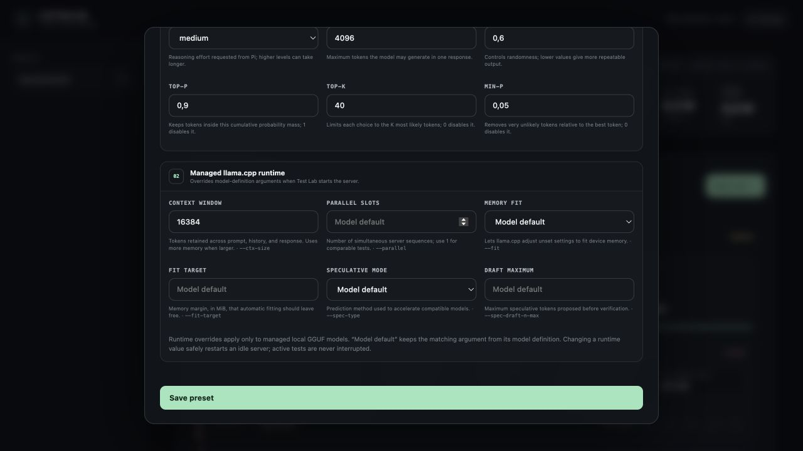
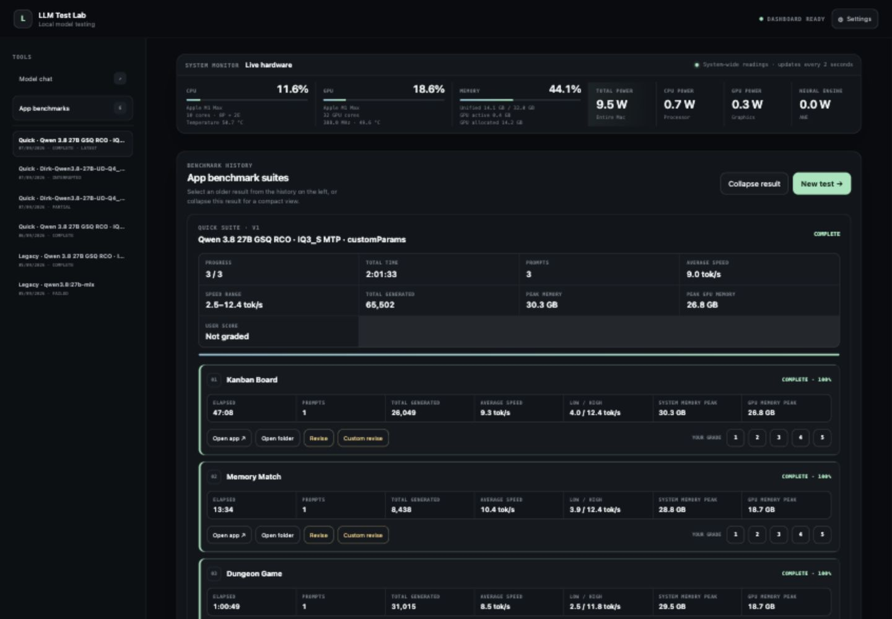

# LLM Test Lab

**A local-first benchmark workbench for autonomous coding models on Apple Silicon.**

LLM Test Lab connects Pi to Ollama, managed GGUF models, or private OpenAI-compatible servers. It runs isolated coding tasks, watches the Mac while they work, and preserves enough evidence to compare speed, resource use, reproducibility, and the quality of the generated apps.



No cloud fallback is required for local models. Test projects, conversations, model weights, credentials, and benchmark history remain on the machine and are excluded from Git.

## What it gives you

- Single autonomous Pi sessions or registered multi-app benchmark suites.
- Clean repetitions in separate folders for meaningful run-to-run comparisons.
- Ollama, managed `llama.cpp` GGUF, and private-LAN OpenAI-compatible model sources.
- A compact direct-model chat with browser-local history and the same model and preset controls.
- Built-in Hugging Face GGUF discovery, quantization selection, download progress, stop, and retry.
- Presets for context, output length, reasoning, sampling, memory fitting, parallel slots, and speculative decoding.
- Live Apple Silicon CPU, GPU, unified-memory, temperature, frequency, and power readings.
- End-to-end token speed, elapsed time, memory peaks, generated files, agent progress, and user quality grades.
- Durable tmux execution with local session and result history.
- Light, dark, and automatic system appearance.

## Quick start

Requirements:

- Apple Silicon Mac
- Node.js 22.19 or newer
- tmux
- Pi coding agent
- optional `macmon` for complete Apple Silicon telemetry

```sh
brew install node tmux
npm install -g --ignore-scripts @earendil-works/pi-coding-agent
brew install vladkens/tap/macmon

git clone <repository-url>
cd LLMTestLab
./testLabStart
```

Open [http://127.0.0.1:4318](http://127.0.0.1:4318).

The project has no npm package dependencies, so `npm install` is not required.

## The workflow

1. Add a model from Ollama, copy a GGUF into `models/`, search Hugging Face, or connect a private inference server.
2. Create a repeatable configuration preset.
3. Run **Test context fit** before an ambitious context or runtime profile.
4. Choose a single prompt or the Quick, Full, or Stress app suite.
5. Let Pi work autonomously and offline in its own tmux session.
6. Watch live hardware and progress, or open the session in Terminal.
7. Launch the generated app, inspect its files, and revise incomplete work through the saved Pi conversation.
8. Grade the finished app and compare prompts, speed, memory, configuration, and outcome.

Each execution gets its own project folder. Pi can stop while the generated files and conversation remain available for inspection.

## Product tour

<table>
  <tr>
    <td width="50%"></td>
    <td width="50%"></td>
  </tr>
  <tr>
    <td><strong>One local control surface.</strong><br>Models, private servers, GPU limits, appearance, and reusable presets.</td>
    <td><strong>Model acquisition inside the app.</strong><br>Search public GGUF repositories and track large downloads without losing partial progress.</td>
  </tr>
</table>

The sidebar also keeps benchmark history compact: select one dated suite at a time, then collapse or expand its result without scrolling through every old run.

## Models and inference servers

### Ollama

Models already registered in Pi's Ollama provider appear automatically under **Ollama · This Mac**. Ollama owns its runtime process and context behavior; Test Lab sends the selected generation settings.

### Managed GGUF

Copy a runnable `.gguf` file into `models/`, then select **Settings → Refresh models** or run:

```sh
./refreshModels
```

Test Lab creates a machine-local definition, assigns a free loopback port, starts `llama-server` in tmux, waits for health, verifies the requested context, and only then starts Pi.

Model weights and generated definitions are ignored by Git. See [models/README.md](models/README.md) for the schema, custom `serverArgs`, and split-GGUF behavior.

### Hugging Face search and downloads

Use **Settings → Add / search model** to inspect public GGUF repositories. Test Lab:

- lists the runnable quantizations rather than downloading an arbitrary file;
- groups split GGUF shards as one model;
- shows byte-level progress for active downloads;
- can stop an active download;
- retries an interrupted download while preserving completed shards;
- refreshes the local model catalog after a successful download.

This is the only built-in workflow that requires internet access.

### Existing local or private-LAN server

Use **Settings → Inference servers → Add inference server** for an OpenAI-compatible endpoint such as `http://192.168.1.50:8080/v1`.

Only loopback, `.local`, private, and link-local addresses are accepted. Public internet endpoints are rejected. API keys stay in ignored `data/servers.json`; they are not returned to the browser by the state API. Leaving the key field blank while editing preserves the saved key.

## Direct model chat



Open **Model chat** from the sidebar to talk directly to any available Ollama, managed GGUF, or private-LAN model. Chat uses the selected configuration preset, proxies requests through the dashboard so saved API keys never reach the browser, and stores the transcript only in browser storage.

Chat and benchmarks do not compete for the same runtime. While a benchmark or context check is active, chat waits instead of contaminating timing and memory measurements. Managed GGUF chat launches use the same single-slot, context-checked runtime path as benchmark sessions.

## Configuration presets

One preset captures both generation behavior and managed `llama.cpp` runtime choices.

<table>
  <tr>
    <td width="50%"></td>
    <td width="50%"></td>
  </tr>
</table>

Generation controls:

- reasoning effort;
- maximum tokens per response;
- temperature;
- top-p;
- top-k;
- min-p.

Managed runtime controls:

- context window → `--ctx-size`;
- parallel slots → `--parallel`;
- memory fitting → `--fit`;
- fit margin → `--fit-target`;
- speculative mode → `--spec-type`;
- maximum draft tokens → `--spec-draft-n-max`.

**Model default** preserves a value declared in the model definition. If neither the model nor the preset specifies parallelism, Test Lab uses one slot because an autonomous benchmark has one active sequence and extra slots multiply KV-cache memory.

Speculative decoding must match the model. For example, select MTP only when the GGUF contains a compatible MTP head.

## Context and memory safety

Large context windows are not free capacity: they reserve KV-cache memory in addition to model weights, runtime buffers, macOS, and every other loaded model.

Before a clean suite or context check, Test Lab now:

1. refuses to interrupt a managed model that an active test still uses;
2. unloads idle managed GGUF servers;
3. restarts the selected model with the exact runtime profile;
4. verifies the context reported by `llama-server`;
5. sends a roughly 6K-token decode probe;
6. records peak unified, active GPU, and allocated GPU memory.

This catches profiles that can open `/health` but fail during actual Metal computation. A context check is only marked **Pass** after decoding succeeds.

The launcher shows the model's declared limit, selected context, currently loaded context, and latest fit result before a run begins.

## Benchmark modes

### Single prompt

Choose any registered prompt and run it once or repeat it up to ten times. Repetitions execute sequentially in `run-01`, `run-02`, and so on, preventing one result from influencing the next.

### App benchmark suites

The built-in app workload runs these autonomous projects in order:

1. Kanban Board
2. Memory Match
3. Dungeon Game

| Suite | Repetitions | Total app runs | Use it for |
| --- | ---: | ---: | --- |
| Quick | 1 | 3 | Compatibility and fast comparisons |
| Full | 3 | 9 | Stable averages and variance |
| Stress | 5 | 15 | Sustained load, thermals, and memory pressure |

Suites snapshot the expanded test plan. Later edits to the registry cannot silently change the meaning of an old result.

## Results and grading



Each completed or failed app has two repair paths:

- **Revise** assumes the result is broken or unfinished, asks Pi to inspect it critically, and continues the original saved conversation in the same project folder.
- **Custom revise** adds the user's exact failure report to that continuation prompt.

Revision attempts clear the previous grade, preserve cumulative token and timing evidence, and increment the visible **Prompts** count. This makes a one-shot success distinguishable from an app that needed several repair turns.

The history intentionally keeps successes and failures. Each app records:

- elapsed time;
- generated and input tokens;
- latest, average, low, and high generation speed;
- peak system and GPU memory;
- peak CPU/GPU utilization and system power;
- Pi's latest progress estimate;
- the number of user prompts, including revision attempts;
- exit status and model error, when present;
- output file count and launchable HTML entry point;
- a user-assigned quality grade from 1 to 5.

Performance is only half the result. A fast model that produces a weak app should remain distinguishable from a slower model that follows the prompt well.

## Reproducibility

Every launch preserves the evidence needed to understand it later:

- `models/*.json` describes the model source, quantization, context metadata, and hardware target;
- `prompts/registry.json` gives each prompt a stable ID, difficulty, version, and SHA-256 hash;
- `suites/registry.json` defines ordered workloads and repetitions;
- a model and configuration snapshot is stored with each run;
- `data/runs.json` and `data/quick-suites.json` store local measurements and grades;
- session JSONL preserves Pi's conversation and token usage.

## Hardware monitoring

With `macmon` installed, the dashboard samples:

- CPU and GPU utilization;
- unified-memory use;
- active and allocated GPU memory;
- CPU and GPU temperature;
- GPU frequency;
- CPU, GPU, neural-engine, and total system power.

The readings are system-wide. Close unrelated heavy workloads before comparisons.

On supported Apple Silicon Macs, **Settings → GPU memory limit** can temporarily change `iogpu.wired_limit_mb`. macOS requests administrator approval, Test Lab reserves at least 4 GB for the system, and the override resets after a reboot. A larger limit does not pre-allocate memory and can reduce system stability.

## Terminal sessions

Tests and managed model servers run in tmux so closing Terminal or the dashboard tab does not destroy active work.

- Select **Open Terminal** while a test is running.
- Mouse scrolling and a 100,000-line history are enabled.
- Press `Ctrl-b`, then `[`, for tmux copy mode; press `q` to leave it.
- Pi runs with autonomous approval and cloud fallback disabled.
- Completed test tmux sessions close; files, exit status, metrics, and conversation remain.

## Local data and privacy

The following are machine-local and excluded from Git:

- `data/` — runs, session metadata, grades, download state, server addresses, and credentials;
- `runs/` — generated benchmark projects;
- `runtime/` — local `llama.cpp` binaries;
- `models/*.gguf*` and generated model JSON;
- custom presets, `.env` files, logs, and common private-key formats.

Removing a single-test registration from the UI preserves its project folder. No benchmark telemetry or generated project is uploaded by the dashboard.

## Commands

```sh
./testLabStart        # start the dashboard or open its existing tmux session
./refreshModels       # register runnable GGUF files under models/
npm start             # run the dashboard in the foreground
npm run check         # validate JavaScript and registry structure
```

To use Homebrew's `llama-server` instead of the bundled runtime:

```sh
brew install llama.cpp
tmux kill-session -t llm-test-lab 2>/dev/null || true
LLAMA_SERVER_BIN="$(command -v llama-server)" ./testLabStart
```

## Environment variables

| Variable | Default |
| --- | --- |
| `PORT` | `4318` |
| `LLM_LAB_DATA_DIR` | `./data` |
| `LLM_LAB_PROMPTS_DIR` | `./prompts` |
| `LLM_LAB_RUNS_DIR` | `./runs` |
| `PI_MODELS_PATH` | `~/.pi/agent/models.json` |
| `PI_BIN` | `pi` from `PATH` |
| `TMUX_BIN` | `tmux` from `PATH` |
| `MACMON_BIN` | `macmon` from `PATH` |
| `LLAMA_SERVER_BIN` | `./runtime/llama.cpp/bin/llama-server` |

## Troubleshooting

### `decode() failed: failed to process speculative batch`

Read the model-server log before assuming MTP itself is broken. On Apple Silicon this can be a secondary error after `Insufficient Memory` from Metal.

- Run **Test context fit** with the exact model and preset.
- Use one parallel slot for a single autonomous benchmark.
- Ensure another large managed model is not resident.
- Reduce context or quantization size if the decode probe still fails.
- Never enable an incompatible speculative mode for the selected GGUF.

### A model loads but the requested context does not

The launch is blocked if `/props` reports less context than the preset requested. Reduce the preset or adjust the managed model arguments.

### Only CPU and RAM are visible

Install `macmon`, then restart the dashboard.

### A copied GGUF is missing

Run `./refreshModels` and confirm that all shards are complete.

### Port 4318 is already used

```sh
PORT=4320 ./testLabStart
```

### New environment variables are ignored

Restart only the dashboard tmux session:

```sh
tmux kill-session -t llm-test-lab
./testLabStart
```

Managed model sessions and generated files remain separate.

## Project layout

```text
LLMTestLab/
├── configs/             tracked and local generation/runtime presets
├── data/                ignored results, sessions, downloads, and secrets
├── docs/assets/         README screenshots
├── models/              local definitions and ignored GGUF weights
├── prompts/             versioned benchmark prompts
├── public/              dependency-free dashboard UI
├── runs/                ignored generated projects
├── runtime/             ignored local llama.cpp build
├── suites/              versioned benchmark plans
├── catalog.mjs          model discovery and preset validation
├── metrics.mjs          Apple Silicon and system telemetry
├── server.mjs           orchestration and local HTTP API
└── testLabStart         persistent dashboard launcher
```

## Roadmap

- Cross-model comparison table with sortable metrics.
- JSON and CSV benchmark-report export.
- Warm-up controls and statistical variance charts.
- Custom suite builder.
- Server-side decode telemetry beside end-to-end Pi timing.

## Credits

The visual direction is adapted from the MIT-licensed ThreeUI Community project. See [THIRD_PARTY_NOTICES.md](THIRD_PARTY_NOTICES.md).
