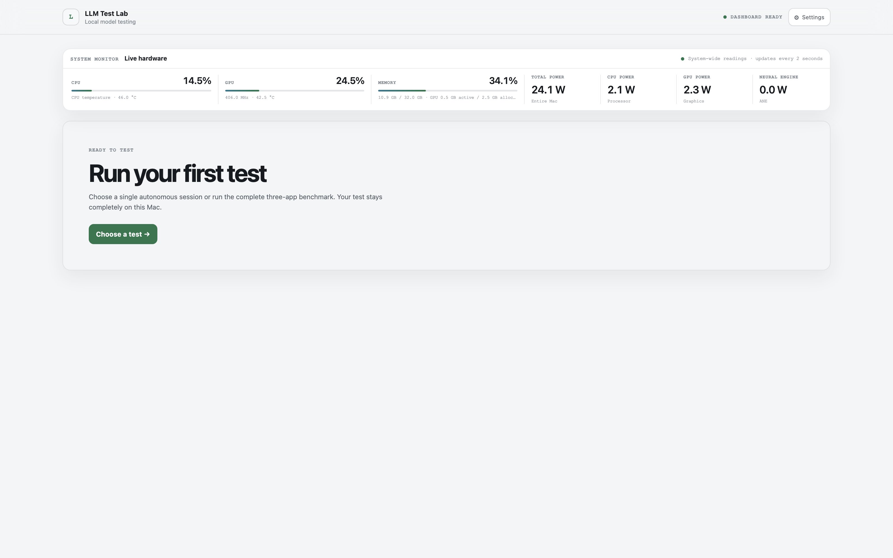

# LLM Test Lab

LLM Test Lab is a local macOS workspace for running repeatable LLM coding tests, comparing model performance, and watching Apple Silicon resources in real time.



It turns a model file and a prompt into a reproducible test record: exact model and prompt metadata, runtime configuration, elapsed time, token speed, memory and power peaks, generated app, and a human quality grade.

> Local by default. Test workspaces, conversations, model weights, generated registrations, and benchmark results are excluded from Git.

## Quick start

Requirements: an Apple Silicon Mac, Node.js 22.19+, tmux, and the Pi coding agent.

```sh
brew install node tmux
npm install -g --ignore-scripts @earendil-works/pi-coding-agent
git clone <repository-url>
cd LLMtestLab
./testLabStart
```

Open [http://127.0.0.1:4318](http://127.0.0.1:4318), add a local model, choose a configuration, and start a test.

For complete Apple Silicon telemetry:

```sh
brew install vladkens/tap/macmon
```

This project has no npm package dependencies, so `npm install` is not required.

## Why it is useful

- Run one autonomous Pi task or a repeatable multi-app benchmark suite.
- Repeat a single test up to ten times in clean folders and compare time, tokens, speed, and memory side by side.
- Use a managed local model, an already-running server on this Mac, or a private-LAN OpenAI-compatible server.
- Compare Quick, Full, and Stress runs with fixed prompt versions and repetitions.
- Record elapsed time, generated tokens, latest/average/low/high tokens per second, peak hardware use, and Pi's clearly labeled progress estimate.
- Grade each generated app from 1–5 and keep quality beside performance.
- Select model, context window, output limit, thinking level, temperature, and top-p before launch.
- Monitor CPU, GPU, unified memory, GPU memory, temperature, frequency, and power.
- Keep long tests in tmux without embedding a terminal in the dashboard.
- Discover local GGUF files or search repositories containing multiple GGUF variants on Hugging Face.
- Use system, light, or dark appearance.

## Typical workflow

1. Put a GGUF model in `models/`, then select **Settings → Refresh models**.
2. Create or edit a configuration preset, including the runtime context window.
3. Select **New test**, choose an inference server and model, then choose a single prompt or a benchmark suite.
4. Start the test. Pi runs autonomously and offline in its own tmux session.
5. Follow live hardware readings or open the tmux session in Terminal when needed.
6. Inspect the generated app, assign a user grade, and compare the recorded results.

Each test gets an isolated project folder. Pi exits when it finishes, and its tmux session closes automatically. The generated project and conversation stay on disk.

For a single prompt, choose 1–10 repetitions before adding the session. Repetitions run sequentially and create `run-01`, `run-02`, and so on inside a new benchmark folder. The session page compares every run without allowing one run's files to influence the next.

## Benchmark suites

The registered app workload runs in a fixed order:

1. Kanban Board
2. Memory Match
3. Dungeon Game

| Suite | Repetitions | Total app runs | Best for |
| --- | ---: | ---: | --- |
| Quick | 1 | 3 | Fast model check |
| Full | 3 | 9 | Stable averages and comparison |
| Stress | 5 | 15 | Sustained load and thermal behavior |

Every case finishes before the next begins. Results update while the suite is running and preserve the expanded test plan, so future registry edits cannot silently rewrite old benchmark history.

## Example: one complete benchmark

Suppose you want to evaluate a new 27B GGUF model:

1. Copy the weight to `models/example-27b-q4.gguf`.
2. Refresh the model folder. Test Lab creates a local model definition.
3. Create a preset named `32K Balanced` with a 32,768-token context and an 8,192-token response limit.
4. Start the **Full** suite. Test Lab runs all three apps three times using the same model and preset.
5. Open each completed app, test the interaction, and give it a 1–5 grade.
6. Read the suite summary for:
   - total time and generated tokens;
   - average, lowest, and highest generation speed;
   - peak unified and active GPU memory;
   - peak CPU/GPU utilization and total system power;
   - per-case measurements and average user score.

Run the same suite with another model or quantization to create a directly comparable record.

## Models

### Add an existing GGUF

1. Copy one or more `.gguf` files into `models/`.
2. Select **Settings → Refresh models**, or run `./refreshModels`.
3. Review the generated machine-local JSON definition if you need custom `llama-server` arguments.

Model weights, partial downloads, and generated definitions are ignored by Git. See [models/README.md](models/README.md) for the model schema and split-GGUF behavior.

### Search Hugging Face

Select **Settings → Add / search model**. Test Lab inspects public GGUF repositories, groups split files, lists every runnable quantization, and downloads only the choice you confirm.

Hugging Face search and download are the only features that require internet access.

### llama.cpp

The default server path is `runtime/llama.cpp/bin/llama-server`. To use a Homebrew installation:

```sh
brew install llama.cpp
tmux kill-session -t llm-test-lab 2>/dev/null || true
LLAMA_SERVER_BIN="$(command -v llama-server)" ./testLabStart
```

### Ollama

Create a machine-local JSON definition in `models/`:

```json
{
  "id": "example-local-model",
  "name": "Example local model",
  "baseUrl": "http://127.0.0.1:11434/v1",
  "reasoning": false,
  "input": ["text"]
}
```

Machine-local model definitions only accept loopback endpoints.

### Existing local or private-LAN server

Open **Settings → Inference servers → Add inference server** and enter an OpenAI-compatible base URL, such as `http://192.168.1.50:8080/v1`. Test Lab calls `/models`, discovers every model exposed by that server, and makes them available under a named server in the New Test model selector.

Only localhost, `.local` hosts, and private or link-local IP ranges are accepted. Public internet endpoints are rejected. Optional API keys are stored only in ignored `data/servers.json`; the state API and browser never receive the saved key. Editing a server with the API-key field blank preserves its existing key.

## Configuration and context size

Open **Settings → Configuration presets** to control:

- runtime context window, from 512 to 1,048,576 tokens;
- maximum response length;
- thinking level;
- temperature and top-p.

For GGUF models, Test Lab checks the context reported by the live `llama-server`. If it differs from the selected preset and the model is idle, the app restarts only that model server with the requested `--ctx-size`. If the model is busy, the launch is blocked instead of interrupting another test. After startup, the reported context is checked again before Pi runs.

Selecting a model also opens a **Context & memory** profile showing its GGUF weight size, context limit declared in the model metadata, selected preset context, currently loaded context, and the latest fit result. **Test context fit** loads the selected context without running Pi, verifies the value reported by `llama-server`, and records peak unified and active GPU memory. Active tests must finish first so the measurement is meaningful and no model process is interrupted.

A request needs room for both its prompt and its generated response. If a 16,445-token request fails against a 16,384-token runtime, choose at least 32,768 tokens for practical headroom. Larger contexts increase KV-cache and unified-memory use, so scale gradually.

## Terminal sessions

The dashboard does not embed Pi sessions. Use **Open Terminal** while a test is active.

- Mouse scrolling is enabled.
- tmux keeps up to 100,000 lines of history.
- If the wheel does not enter history, press `Ctrl-b`, then `[`. Navigate with arrows or Page Up/Page Down, then press `q` to return.
- Pi uses autonomous, approved, offline mode and exits after completing its task.
- The tmux session closes after Pi exits; Test Lab preserves the exit state and files.

## Registries and reproducibility

- `models/*.json` describes provider, quantization, context, and hardware target. A model snapshot is saved with every run.
- `prompts/registry.json` gives every prompt a stable ID, category, difficulty, version, and SHA-256 hash of its exact text.
- `suites/registry.json` defines ordered workloads and repetition counts.
- `data/runs.json` and `data/quick-suites.json` store local execution metadata, measurements, and grades.

Prompt hashes and launch snapshots make results understandable even after the source definitions evolve.

## Hardware monitoring

Install `macmon` for Apple Silicon GPU utilization, temperature, frequency, and power readings. CPU and RAM fall back to Node's system APIs when `macmon` is unavailable.

**Settings → GPU memory limit** can temporarily change `iogpu.wired_limit_mb` on supported Macs. macOS requests administrator approval, the dashboard keeps at least 4 GB for the system, and the override resets after restart. Increasing the limit does not pre-allocate memory and can reduce system stability if set too high.

## Local data and privacy

The following stay out of Git:

- `data/` — session metadata, results, grades, server addresses and credentials, and download state;
- `runs/` — generated test projects;
- `runtime/` — local llama.cpp binaries;
- `models/*.gguf*` and `models/*.json` — weights and machine-local registrations;
- custom presets, `.env` files, logs, and private-key formats.

Removing a session from the UI removes its Test Lab registration and tmux process but preserves its project folder. No telemetry or generated project is uploaded by the application.

## Commands

```sh
./testLabStart        # start the dashboard, or open its existing tmux session
./refreshModels       # scan models/ and create missing local definitions
npm start             # run the dashboard in the foreground
npm run check         # validate JavaScript and registry structure
```

## Environment variables

| Variable | Default |
| --- | --- |
| `PORT` | `4318` |
| `LLM_LAB_DATA_DIR` | `./data` |
| `LLM_LAB_PROMPTS_DIR` | `./prompts` |
| `LLM_LAB_RUNS_DIR` | `./runs` |
| `PI_MODELS_PATH` | `~/.pi/agent/models.json` |
| `PI_BIN` | `pi` from `PATH` |
| `TMUX_BIN` | `tmux` from `PATH` |
| `MACMON_BIN` | `macmon` from `PATH` |
| `LLAMA_SERVER_BIN` | `./runtime/llama.cpp/bin/llama-server` |

## Troubleshooting

- **Only CPU and RAM appear:** install `macmon`, then restart the dashboard.
- **A prompt exceeds the available context:** increase the selected preset's runtime context window; the next idle GGUF launch restarts the server with that value.
- **A GGUF model will not launch:** verify `llama-server` or set `LLAMA_SERVER_BIN` before starting the dashboard.
- **A model is missing:** run `./refreshModels` after copying it into `models/`.
- **Port 4318 is busy:** run `PORT=4320 ./testLabStart`.
- **New environment variables are ignored:** stop only the dashboard with `tmux kill-session -t llm-test-lab`, then start it again.

## Roadmap

- Cross-model comparison table with filters and sortable metrics.
- Exportable benchmark reports in JSON and CSV.
- Warm-up controls and richer statistical variance charts for repeated runs.
- Custom suite builder in the dashboard.
- Optional server-side decode telemetry alongside end-to-end Pi timing.

## Credits

The visual direction is adapted from the MIT-licensed ThreeUI Community project. See [THIRD_PARTY_NOTICES.md](THIRD_PARTY_NOTICES.md).
